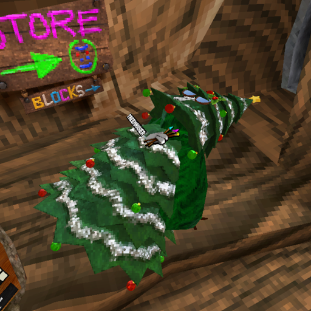

# Backflip
A BepInEx mod for Gorilla Tag that does a backflip when you double tap the A button on your right controller

## Installation
1. Download the latest `Backflip.dll` from the [Releases page](https://github.com/struuct/CosmeticNames/releases)
2. Place the `Backflip.dll` file in your `BepInEx/plugins` folder
3. Launch the game, double tap the A button on your right controller to do a backflip

## Additional Info
If you want more mods like this and more exclusive mods that aren't available on my GitHub, join my [Discord server](https://struct.fyi/discord)
